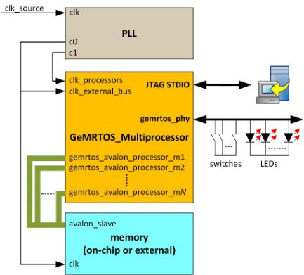
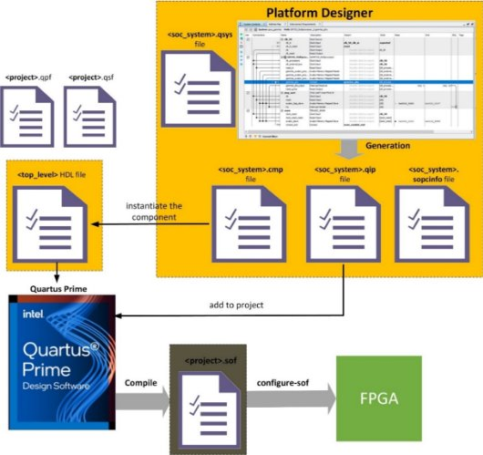

<table>
<tr>
<td>  

   

</td>
<td>

 

</td>
</tr>
<tr>
<td>  

 

</td>
<td>

   

</td>
</tr>
</table>

![A black and white logo Description automatically generated]

# GeMRTOS: Multiprocessor RTOS

## Reference Design

[Download PDF version](https://gemrtos.com/gemrtos_manual/GeMRTOS_multiprocessor_reference_design.pdf)

# Objectives
- Create a multiprocessor GeMRTOS system by defining the number of Nios II or Nios V soft-processors as a parameter in Intel’s Platform Designer GUI. 
- Develop an embedded application that demonstrates task execution across different processors. 
- Demonstrate that the design flow of a GeMRTOS multiprocessor application is similar to that of designing a uniprocessor application in Intel’s Platform Designer.

#

Date: September 11, 2024

Revision: 1.0

# Contents

[Objectives](#_toc176950308)

[Background](#_toc176950307)

[System Architecture](#_toc176950309)

[GeMRTOS Multiprocessor IP component](#_toc176950310)

[GeMRTOS design flow](#_toc176950311)

>[Designing the GeMRTOS multiprocessor hardware architecture](#_toc176950312)

>>[Step 1: Create a folder for your GeMRTOS project](#_toc176950313)

>>[Step 2: Licensing GeMRTOS](#_toc176950314)

>>[Step 3: Open Quartus Prime project](#_toc176950315)

>>[Step 4: Open the Intel’s Platform Designer project](#_toc176950316)

>>[Step 5: Add the GeMRTOS Multiprocessor component](#_toc176950317)

>>[Step 6: Design the Intel’s Platform Designer system](#_toc176950318)

>>[Step 7: Build the Intel’s Platform Designer system and compile the Quartus Prime project](#_toc176950319)

>[Designing the GeMRTOS multiprocessor software application](#_toc176950320)

>>[Alternative 1: Building the application with the gemrtos_build script](#_toc176950321)

>>[Alternative 2: Executing all the steps to create the software application](#_toc176950322)

[Getting a Multiprocessor system running: the easiest way](#_toc176950323)

#

# Background
This design exemplifies the straightforward and efficient use of GeMRTOS in the implementation of multiprocessor systems on Intel FPGA devices. GeMRTOS is provided as an IP component that integrates seamlessly with Intel's Platform Designer, functioning as an easily accessible library component.

With GeMRTOS, the process of creating a multiprocessor RTOS mirrors the simplicity of traditional uniprocessor design flows. The system supports both Nios II and Nios V soft-processors, which can be conveniently selected from the Platform Designer's parameter configuration interface for the GeMRTOS component.

The multiprocessor architecture of GeMRTOS enhances the performance of embedded applications while simultaneously reducing the time required during the design phase. Moreover, it simplifies maintenance by allowing implementations to be conceptualized as modular subsystems—a particularly valuable feature given the complexity of modern applications.

As FPGA capacities continue to increase, the design of multiprocessor systems on a single chip becomes increasingly feasible. Intel’s design tools, combined with GeMRTOS, enable the benefits of embedded multiprocessor systems to be realized without the associated complexities.

# System Architecture
The proposed reference design is centered around the GeMRTOS Multiprocessor IP. The system is completed by adding the following components:

- **PLL Component**: GeMRTOS supports different clocks for processors and system devices. To enhance system performance, the processors are configured to run at 25 MHz, while the system bus clock is set to 100 MHz.
- **Memory component or memory controller**: The system includes memory to store applications.

The system architecture resembles that of a uniprocessor system based on the Nios II or Nios V soft-processor, with the GeMRTOS controller replacing the processor. Additionally, the architecture is simplified as it does not require a timer device or the JTAG UART typically found in Altera's soft-processor examples.

The GeMRTOS multiprocessor IP component includes optional JTAG UARTs for STDIO and STDERR consoles, which the user may choose to enable through the parameter configuration GUI. It also provides a JTAG UART for each processor, which can be enabled and may be found useful for debugging purposes. Additionally, it features a conduit port for easy management of LEDs and switches on most development FPGA boards. The GeMRTOS multiprocessor IP component is designed to simplify the complex task of multiprocessor design. 

Figure [1](#figure_system_architecture) demonstrates the proposed design architecture.

*Figure 1: reference design hardware architecture.*

The software architecture of GeMRTOS allows applications to be configured as a set of tasks assigned to hybrid scheduling lists. GeMRTOS employs an innovative hybrid partitioned scheduling approach that leverages these lists to optimize task execution across multiple processors. Tasks are assigned to scheduling lists either statically or dynamically, and processors are allocated to one or more of these lists. This flexible configuration supports the partial implementation of partitioned/semi-global scheduling, ensuring that processors do not remain idle when tasks are available in their assigned scheduling lists. Figure [2](#figure_gemrtos_hybrid_layout) demonstrates how tasks and processors can be allocated using the GeMRTOS hybrid scheduling list.

*Figure 2. GeMRTOS hybrid scheduling.*

Management of tasks, resources, and scheduling algorithms is easily implemented due to the flexible multiprocessor architecture of GeMRTOS.
# GeMRTOS Multiprocessor IP component
The GeMRTOS Multiprocessor IP component simplifies the design of multiprocessor systems by reducing the complexity of processor booting, synchronization, and mutual exclusion, making it as straightforward to design a multiprocessor system as it is to design a uniprocessor system. 

As shown in Figure [3](#figure_gemrtos_structure), the structure of the GeMRTOS Multiprocessor IP includes the following components:

- **The GeMRTOS controller**: This serves as the core of the GeMRTOS Multiprocessor IP component, responsible for time management and external events, and enabling the gemrtos Avalon-conduit port for easy access to external signals.
- **The System Processor**: The IP component supports Nios II and Nios V soft-processors in various versions and parametrizations.
- **The MM-Avalon bridge for external devices**: This bridge allows for the definition of different clock sources for processors and external devices, thereby enabling clock domain adaptation to improve overall performance.
- **The JTAG-UART devices**: These devices can be enabled for STDIO and STDERR consoles, as well as for each system processor, which simplifies design and facilitates system debugging.
- **The MM-Avalon bridge for HPS interface**: This allows access to and from the HPS domain memory map, though deep knowledge is required for effective use.

*Figure 3: GeMRTOS multiprocessor internal structure.*

Overall, the GeMRTOS Multiprocessor IP component significantly reduces the challenges associated with designing complex multiprocessor systems, thereby streamlining the development process and improving efficiency.
# GeMRTOS design flow
Designing a multiprocessor system with GeMRTOS closely resembles the process of designing a uniprocessor system. 

The first step involves designing the hardware architecture, followed by the creation of the software application. 
## Designing the GeMRTOS multiprocessor hardware architecture.
Designing the GeMRTOS multiprocessor hardware architecture involves modifying an SOPC design tailored to a specific development kit. Development kits typically offer example configurations that include all necessary components, making it advantageous to start with one of these examples. This approach eliminates the need to manually configure the kit board's pinouts, especially for components like the DDR memory controller, if available. GeMRTOS reference design projects for various boards, such as the [DE2-115](https://gemrtos.com/gemrtos_manual/DE2_115.zip), [MAX10 FPGA](https://gemrtos.com/gemrtos_manual/MAX10FPGA.zip), [Bemicro SDK](https://gemrtos.com/gemrtos_manual/bemicroSDK.zip), can be asked for on [gemrtos.com](https://gemrtos.com/download/).
### Step 1: Create a folder for your GeMRTOS project
First, create a folder and copy the base Quartus Prime project into it. This folder will be referenced as <*Quartus\_Prime\_project\_folder*>. The folder must include the following files to create a valid Intel’s Platform Designer project:

- <*quartus\_project\_name*>**.qpf**: This file contains all the information about the files that constitute the project and must be opened when the project is launched in Quartus Prime.
- <*quartus\_project\_name*>**.qsf**: This file contains all the project settings. It is supplied by the board manufacturer and includes the names assigned to each pin associated with the components in the development kit.
- <*top\_level\_entity\_file*>**.v** or **.vhd:** This file contains the hardware description of the top level entity to be implemented on the FPGA device. It mainly instantiates the embedded system created with Intel’s Platform Designer, which will include the GeMRTOS IP component.

If the project is based on a demonstration example provided by the kit or board manufacturer, the GeMRTOS IP component should be added to the project for instantiation in the Intel’s Platform Designer tool. If the project is obtained from gemrtos.com, proceed to Step [2](#step_licensing_gemrtos).
#### *Installing GeMRTOS into the project*
The GeMRTOS IP component is fully compatible with Intel’s Platform Designer. To include the GeMRTOS IP component in the project, copy the /ip subfolder into the <Quartus\_Prime\_project\_folder>. The GeMRTOS IP subfolder can be obtained by downloading the GeMRTOS IP compressed file from the provided [link](https://gemrtos.com/gemrtos_manual/GeMRTOS_ip.zip).

The basic structure of the <Quartus\_Prime\_project\_folder> should resemble the one shown in Figure [4](#figure_gemrtos_directory_structure).

*Figure 4: GeMRTOS basic project directory structure.*

It is essential to verify that all necessary files are correctly placed within the <Quartus\_Prime\_project\_folder>. This ensures a seamless integration of the GeMRTOS IP component during subsequent steps. Proper organization and verification at this stage will facilitate efficient project development and minimize potential errors during the hardware design process.
### Step 2: Licensing GeMRTOS
GeMRTOS requires a license to be used in Intel’s Platform Designer. A valid license can be downloaded from the provided [link](https://gemrtos.com/license/). Quartus Prime supports both Fixed and Floating licenses, and the appropriate option must be selected based on the current licensing type of Quartus Prime. The Fixed license can be easily configured by browsing to the license file through the License Setup window (**Tools** → **License Setup…**). Figure 5 illustrates the configuration of the Fixed license option.

*Figure 5: GeMRTOS fixed license setting.*

It is crucial to verify that the GeMRTOS license has been correctly configured within Intel’s Quartus Prime. Ensuring proper license configuration is essential for the smooth operation of GeMRTOS and for avoiding potential issues during project compilation. Once the license setup is confirmed, the GeMRTOS IP component will be fully operational within the Quartus Prime environment, allowing for seamless integration and further development of the multiprocessor system.
### Step 3: Open Quartus Prime project
Opening the project file containing all relevant design files and settings is necessary to initiate the hardware design process. The project located in the <Quartus\_Prime\_project\_folder> directory should be opened by selecting “**File** → **Open Project…**” as shown in Figure [6](#figure_gemrtos_opening_project), and then proceeding with the subsequent steps provided in the software interface.

*Figure 6: Opening Quartus Prime Project.*

After opening the project file, it is essential to verify that all design files and settings have been correctly loaded. This ensures that the Quartus Prime environment is properly configured for the subsequent stages of hardware development. Any discrepancies in file loading or settings may result in errors during synthesis or implementation, which can affect the overall design process. Therefore, a thorough review of the project setup at this stage is crucial to achieving accurate and efficient design outcomes.
### Step 4: Open the Intel’s Platform Designer project
The Intel’s Platform Designer tool is essential for designing the embedded system that includes the GeMRTOS multiprocessor system. To begin, open Intel’s Platform Designer by selecting “**Tools** → **Platform Designer**” as shown in Figure [7](#figure_gemrtos_opening_qsys).

*Figure 7: Opening Intel’s Platform Designer tool.*

Executing this option opens the Intel’s Platform Designer GUI. Before starting, choose the <platform\_designer\_file>.**qsys** file that contains the embedded system. This file should be located in the <Quartus\_Prime\_project\_folder>. Once selected, the Intel’s Platform Designer GUI will be available, as illustrated in Figure [8](#figure_gemrtos_qsys_gui).

Intel’s Platform Designer enables the straightforward design of the GeMRTOS multiprocessor-based system. The GeMRTOS Multiprocessor component is accessible in the IP Catalog tab, and the System Contents tab displays all elements of the GeMRTOS multiprocessor system, as shown in Figure [1](#figure_system_architecture).
### Step 5: Add the GeMRTOS Multiprocessor component
Next, the GeMRTOS Multiprocessor component must be added to the system, which can be configured with either a Nios II or a Nios V processor. To do this, navigate to **Project** → **GeMRTOS** → **GeMRTOS Multiprocessor** within the **IP Catalog** tab and click the **Add** button. Figure [9](#figure_gemrtos_parameter_panel) shows the GeMRTOS parameter configuration panel, which appears when the GeMRTOS Multiprocessor component is added or selected in the System Component window. This panel allows for configuring several features of the final multiprocessor architecture.

*Figure 8: Intel’s Platform Designer GUI.*

*Figure 9: GeMRTOS Multiprocessor parameter configuration.*

Successfully adding and configuring the GeMRTOS Multiprocessor component in Intel’s Platform Designer is a critical step in designing a functional multiprocessor system. This step ensures that the GeMRTOS IP component is properly integrated with the selected processor (Nios II or Nios V), allowing for further configuration and refinement of the multiprocessor architecture. Ensuring each feature is correctly set at this stage will contribute to the system’s overall performance and functionality during implementation.
#### *Configuring the GeMRTOS hardware parameters*
When the GeMRTOS Multiprocessor component is added or double-clicked within Intel’s Platform Designer, the Parameters tab becomes accessible. This tab allows for the configuration of various hardware parameters critical to the GeMRTOS Multiprocessor component. The primary parameters available for configuration include the following:

- **Number of Processors**: Specifies the number of processors to be included in the system. The GeMRTOS Multiprocessor component manages all internal configurations to accommodate the selected number of processors.
- **Processor Type**: Determines the type of processor used in the system. GeMRTOS supports both Nios II and Nios V soft-processors in various versions, and the processor type can be easily selected from the available options.
- **Reset Vector Memory**: Identifies the memory device that contains the reset vector for the multiprocessor system. The list of memory devices is populated based on the devices connected to the GeMRTOS Multiprocessor buses, and no devices will appear until the component is connected, similar to the behavior in uniprocessor systems using Nios II or Nios V processors.
- **Reset Vector Offset**: Specifies the offset of the reset vector within the chosen reset vector memory device.
- **Exception Vector Memory (only for Nios II)**: Similar to Reset Vector Memory, but specifically for the exception vector. This parameter is only applicable to Nios II processors.
- **Exception Vector Offset (only for Nios II)**: Specifies the offset of the exception vector within the chosen exception vector memory device, applicable only to Nios II processors.
- **Instruction Cache Size**: Defines the size of the instruction cache, applicable only to processors that support this feature.
- **Enable Pipeline in CPU (Nios V/m only)**: Indicates whether the pipeline stage is enabled when using the Nios V processor.
- **Independent External Processor Buses**: Determines whether each processor has a separate external bus or if a single external bus is shared among all processors in the GeMRTOS Multiprocessor component. Independent external buses can be beneficial for shadowing external devices at the same memory map address for each processor, potentially improving performance in certain applications.
- **Include JTAG UART for STDIO**: If enabled, a JTAG UART is included as the standard input/output (STDIO) interface for the system.
- **Include JTAG UART for STDERR**: If enabled, a JTAG UART is included as the standard error (STDERR) interface for the system.
- **Include JTAG UART for Each Processor**: If enabled, a JTAG UART is included for each processor, allowing all processors to access each JTAG UART, which can be useful for debugging purposes.
- **Enable HPS Internal Access**: If enabled, an Avalon bridge is included to allow the HPS system to access the GeMRTOS Multiprocessor bus and all its internal devices.
- **Quartus Prime Project Name**: Allows the selection of the Quartus Prime project available in the work directory. Setting this field configures the gemrtos\_build script for easy building of the SOPC system.
- **Platform Designer Project Name**: Allows the selection of the Intel’s Platform Designer project available in the work directory. Setting this field configures the gemrtos\_build script for easy building of the SOPC system.

These parameters must be carefully configured to ensure the GeMRTOS Multiprocessor component operates as intended within the overall system design.
### Step 6: Design the Intel’s Platform Designer system
As with uniprocessor systems based on Nios II or Nios V processors, the remaining components in the system must be added and interconnected. If the "**Independent External Processor Buses**" option is enabled, each processor bus must be connected to the appropriate devices. Memory devices should be connected before selecting the **Reset and Exception Vector Memory**, as valid options are derived from the memory devices attached to the bus of the processor with an ID equal to 1. Figure [10](#figure_gemrtos_bus_connection) provides an example of how the 10 processor buses of the GeMRTOS Multiprocessor-based system are connected to a 34404-byte on-chip memory in a DE2-115 board to store the entire application. Additionally, the GeMRTOS Multiprocessor buses are connected to the PLL device, and they can be connected to any other component in the system.

*Figure 10: GeMRTOS Multiprocessor conections.*

Similar to Nios II or Nios V processors, interrupt signals must be connected to the *gemrtos\_dirq\_input* port of the GeMRTOS Multiprocessor component. The GeMRTOS Multiprocessor component significantly simplifies the design of multiprocessor systems in much the same way as uniprocessor designs. It helps manage complexities such as exclusion components, boot synchronization, interrupt management, system time management, and processor identification.
### Step 7: Build the Intel’s Platform Designer system and compile the Quartus Prime project
Once the design is complete, the system should be generated in Intel’s Platform Designer, and the GeMRTOS Multiprocessor component should be instantiated in the Quartus Prime project. This step is necessary for compiling the final hardware configuration for the FPGA board. The component in the Quartus Prime project may also need modifications to include conduit ports added by the GeMRTOS Multiprocessor component. These modifications are straightforward if the new signals are incorporated in a manner similar to the existing ones in the project.

Upon completion of all steps, a **.sof** or **.pof** file will be generated to program the FPGA device. After generating the system in Intel’s Platform Designer, a **.sopcinfo** file is created, containing all the necessary information to generate the **BSP project** (Board Support Package), which serves as the software layer supporting the user application. 

Figure [11](#figure_gemrtos_quartus_flow) illustrates the layout of the hardware creation flow, following the design methodology proposed by Intel/Altera for implementing embedded SOPC systems on FPGA devices. This flow outlines the step-by-step process involved in configuring and designing hardware components, using tools such as Quartus Prime and Intel’s Platform Designer to integrate various elements, including the GeMRTOS Multiprocessor system, into the FPGA architecture.

*Figure 11: Quartus Prime / Platform Designer design flow.*

The software creation flow is detailed in the next section and follows a process similar to that for uniprocessor systems based on Nios II or Nios V processors.

## Designing the GeMRTOS multiprocessor software application.
Building the software application for a GeMRTOS Multiprocessor system closely follows the flow established for Nios II and Nios V processors. The process relies on the BSP project, which contains the necessary device drivers for all components included in the Intel’s Platform Designer project. The configuration of these devices is based on the information provided in the **.sopcinfo** file generated during the Intel’s Platform Designer process. This file consolidates all the relevant details about the devices connected to the system, ensuring the software layer is correctly aligned with the hardware design. The software layer, shown in Figure  [12](#figure_gemrtos_software_layers), contains both the BSP project and the Application project.

*Figure 12: GeMRTOS software layer containing the BSP and Application projects.*

The software building flow consists of several steps, each carried out by executing specific commands in the correct order. These commands must be executed in different environments, depending on the processor selected in the GeMRTOS Multiprocessor component. If the Nios II processor is chosen, the commands should be run in the Nios II Command Shell, while the Nios V Command Shell should be used when Nios V is selected as the Processor Type (see Figure [13](#figure_command_shell_commands)). 

*Figure 13: Quartus Prime / Platform Designer design flow.*

***Note**: The Nios II Command Shell requires a Linux-like environment. Earlier versions of Quartus Prime utilized the Cygwin environment to execute these commands. However, Quartus Prime versions later than 22.0 now use the Windows Subsystem for Linux (WSL) command-line environment. The procedures for installing Quartus Prime version 22.0 and configuring WSL for the GeMRTOS design flow on Windows 10-64bit systems are detailed [here](https://gemrtos.com/gemrtosdocs/installation-of-quartus-prime-with-wsl-1-for-gemrtos-design-flow/).*
### Alternative 1: Building the application with the gemrtos\_build script.
To simplify the software building flow, the GeMRTOS Multiprocessor component generates the *gemrtos\_build* script (**.sh** for Nios II processors and **.bat** for Nios V processors). This script automates the essential steps for building a GeMRTOS application, reducing the complexity of manual configuration and improving efficiency, especially for those new to GeMRTOS and Intel’s design flow. The script should be executed from the command line of the Nios II or Nios V Command Shell within the <*Quartus\_Prime\_project\_folder*> directory: 

- for Nios II, the command is:

<Quartus\_Prime\_project\_folder>/bash gemrtos\_build.sh

- for Nios V, the command is:

<Quartus\_Prime\_project\_folder>/gemrtos\_build.bat

The *gemrtos\_build* script performs several key operations, configured with parameters from the GeMRTOS Multiprocessor component’s parameter panel:

- **Platform Designer Project Name**: Specifies the Platform Designer project file (**.qsys**) located in the Quartus Prime project’s main directory (<*Quartus\_Prime\_project\_folder*>).
- **Quartus Prime Project Name**: Identifies the Quartus Prime project where the Platform Designer project, containing the GeMRTOS IP component, is instantiated.
- **Application Project Name**: Determines the name of the application executed by the GeMRTOS multiprocessor. By default, the *hellogemrtos* project is created in the <*Quartus\_Prime\_project\_folder*> /software subdirectory.
- **BSP Project Name**: Defines the name of the Board Support Package (BSP) associated with the application, stored in the <*Quartus\_Prime\_project\_folder*> /software /hellogemrtos\_bsp subdirectory.

The execution of the *gemrtos\_build* script involves the following steps (Figure [14](#figure_gemrtos_sequence_diagram)):

1. Generate the Intel’s Platform Designer system.
1. Compile the Quartus Prime project, creating the <quartus\_project\_name>.sof file.
1. Generate the BSP settings file (**.bsp)** and BSP project directory.
1. Set up the software directory and, if absent, include the *hellogemrtos.c* template file.
1. Compile both BSP and application projects, producing the *hellogemrtos***.elf** file.
1. Transfer the **.sof** file to the FPGA using the Quartus Prime Programmer tool.
1. Open terminals to connect with the system's JTAG UARTs.
1. Download and initiate execution of the *hellogemrtos***.elf** on the target hardware.

*Figure 14: gemrtos\_build script sequence diagram.*

Upon completion, the multiprocessor application will begin executing on the GeMRTOS Multiprocessor system, with system and task messages displayed in the connected terminals.
### Alternative 2: Executing all the steps to create the software application.
The *gemrtos\_build* script offers a convenient way to start working with SOPC in FPGA devices and is even simpler than building uniprocessor systems based on Nios II or Nios V processors. The script also accepts command-line options to override default settings. However, for users who wish to control each step of the process, the entire building flow can be executed manually via a sequence of commands in the chosen processor’s Command Shell.

***Note**: In this approach, the commands to generate the Intel’s Platform Designer system and compile the Quartus Prime hardware project—performed using graphical interfaces in the previous Section (Designing the GeMRTOS multiprocessor hardware)—are included as command-line functions for completeness. These steps are also integrated into the gemrtos\_build script to fully automate the design flow.*

#### *Step 1: Update the IP cores of the Intel’s Platform Designer project*
It is recommended to update the IP cores used in the Intel’s Platform Designer project to the latest version. This can be done by running the following command:

- for Nios II:

qsys-generate.exe <Platform\_Designer\_project\_name>.qsys --upgrade-ip-cores

- for Nios V:

%QSYS\_ROOTDIR%/qsys-generate <Platform\_Designer\_project\_name>.qsys --upgrade-ip-cores

*Note: %QSYS\_ROOTDIR% is an environment variable that specifies the directory where the Intel’s Platform Designer tools are installed.* 

This step is usually performed when opening a project in Intel’s Platform Designer, especially if the project was created using a previous version of the tool. If the components are already updated, no action is required.

The *gemrtos\_build* script performs this command automatically based on the project name specified in the "**Platform Designer project name**" parameter of the GeMRTOS Multiprocessor component configuration panel. To override this value, use the -qsys option:

- For Nios II

bash gemrtos\_built.sh -qsys <Platform\_Designer\_project\_name>

- For Nios V

gemrtos\_built.bat -qsys <Platform\_Designer\_project\_name>
####
#### *Step 2: Generate the Intel’s Platform Designer project*
This step generates the Intel’s Platform Designer system, producing files for synthesis and the .**sopcinfo** file. This can be achieved by executing the following command:

- for Nios II:

qsys-generate.exe <Platform\_Designer\_project\_name>.qsys --synthesis=VERILOG

- for Nios V:

%QSYS\_ROOTDIR%/qsys-generate <Platform\_Designer\_project\_name>.qsys --synthesis=VERILOG 

**Note**: This command performs the same action as clicking the "Generate HDL" button in Intel’s Platform Designer. The *gemrtos\_build* script also handles this step automatically, but the project name can be overridden using the -qsys option.
####
#### *Step 3: Compile the Quartus Prime project*
If the Intel’s Platform Designer or Quartus Prime project files have been modified, a full compilation of the generated hardware is required. The following command will perform this:

- For both Nios II and Nios V:

quartus\_cmd.exe <Quartus\_Prime\_Project\_Name>.qpf -c <Quartus\_Prime\_Project\_Name>.qsf

**Note**: The *gemrtos\_build* script uses the project name specified in the "**Quartus Prime Project Name**" parameter of the GeMRTOS Multiprocessor component’s configuration panel. To override this, use the -qpr option:

- For Nios II:

bash gemrtos\_build.sh -qpr <Quartus\_Prime\_Project\_Name>

- For Nios V

gemrtos\_build.bat -qpr <Quartus\_Prime\_Project\_Name>

This step compiles the entire hardware project and may take some time to complete. It is recommended to execute this step, along with Step 1 and Step 2, only when the Intel’s Platform Designer or Quartus Prime project files have been modified.
#### *Step 4: Generate the BSP settings file*
The BSP project contains the software support package for the hardware. It retrieves hardware information from the .**sopcinfo** file and includes the device drivers for all components in the Intel’s Platform Designer project. The following commands generate the BSP project:

- For Nios II:

nios2-bsp hal ./<BSP\_sub\_folder> <Platform\_Designer\_project\_name>.sopcinfo --cpu-name <GeMRTOS\_Multiprocessor\_component\_name>\_gemrtos\_proc\_1 -–cmd="set\_setting hal.enable\_reduced\_device\_drivers true"

- For Nios V

niosv-bsp -c --sopcinfo=<Platform\_Designer\_project\_name>.sopcinfo --type=hal -i=<GeMRTOS\_Multiprocessor\_component\_name>\_gemrtos\_proc\_1 -–cmd="set\_setting hal.enable\_reduced\_device\_drivers true" <BSP\_sub\_folder>/settings.bsp 

where:

<BSP\_sub\_folder> is the destination folder for the BSP project, which by default is located in the ./software subdirectory.

<Platform\_Designer\_project\_name> refers to the name of the Intel’s Platform Designer project.

<GeMRTOS\_Multiprocessor\_component\_name> is the name assigned to the GeMRTOS Multiprocessor component in the Intel’s Platform Designer project (by default, this is set to “GeMRTOS\_Multiprocessor\_0”). 

Executing this command creates or updates the settings.bsp file within the BSP project folder. The BSP project is configured with the processor that has an ID equal to 1 as the reference for the project.

***Note**: The BSP project is created similarly to a uniprocessor BSP project, but with the added requirement of specifying the reference processor in a multiprocessor system. By default, the processor with ID 1 is used as the reference.*

If it is wanted to get the correct arguments, it can be executed:

- for Nios II:

qsys-script.exe --system-file< Platform\_Designer\_project\_name>qsys --script=./ip/GeMRTOS\_Multiprocessor/qsysscript.tcl

- for Nios V:

%QSYS\_ROOTDIR%/qsys-script.exe --system-file< Platform\_Designer\_project\_name>qsys --script=./ip/GeMRTOS\_Multiprocessor/qsysscript.tcl

This command will produce the command line to execute according the configuration of the system.

#### *Step 5: Generate the Application project*
The application project references the BSP project and contains application files, including the main function. The project can be generated using the following commands:

- For Nios II:

nios2-app-generate-makefile.exe --bsp-dir ./ <BSP\_sub\_folder> --app-dir ./<Application\_folder> --elf-name <Application\_name>.elf --set APP\_CFLAGS\_USER\_FLAGS \"-Wa,-relax-all\" --inc-rdir ./ <Application\_folder> --src-rdir ./ <Application\_folder>

- For Nios V:

niosv-app --app-dir=<Application\_folder>  --srcs=<Application\_folder>  --bsp-dir=<BSP\_sub\_folder>

**Note**: GeMRTOS provides the hellogemrtos.c file, which can be used as a starting program. This file is located in the ./ip/GeMRTOS\_Multiprocessor folder.

#### *Step 6: Compile the projects and generate the .elf file*
The BSP and application projects must be compiled separately for Nios II. For Nios V, the process is different, as shown below:

- For Nios II:

cd <BSP\_sub\_folder>

make all

cd <Quartus\_Prime\_project\_folder>

cd <Application\_folder>

make all

- For Nios V:

cmake -G "Unix Makefiles" -B <Application\_folder> -S <Application\_folder>

make -C <Application\_folder>

The compilation process produces the .**elf** file, which is used to program the application onto the FPGA.
#### *Step 7: Program the FPGA device*
Programming the FPGA can be done using the Quartus Prime Programmer tool or by running the following command:

quartus\_pgm.exe -m JTAG -o "p;output\_files/<Quartus\_Prime\_Project\_Name>. sof"

For devices where the FPGA configuration is second in the programming chain, use:

quartus\_pgm.exe -m JTAG -o "p;output\_files/<Quartus\_Prime\_Project\_Name>. sof@2"

**Note**: After successful execution, the FPGA will be configured with the hardware architecture. The system’s processors and JTAG UARTs can be verified by running:

jtagconfig.exe -n

showing the processors and JTAG UARTs accessible through the JTAG interface:

\1) USB-Blaster [USB-0]

`  `020F30DD   10CL025(Y|Z)/EP3C25/EP4CE22

`    `Design hash    0CBAE831A5A1AE5AA13C

`    `+ Node 19104600  Nios II #0

`    `+ Node 19104601  Nios II #1

`    `+ Node 19104602  Nios II #2

`    `+ Node 0C006E00  JTAG UART #0

`    `+ Node 0C006E01  JTAG UART #1

`    `+ Node 0C206E00  JTAG PHY #0

`    `+ Node 0C006E02  JTAG UART #2

#### *Step 8: Download the application*
The application can be downloaded and started with the following commands:

- For Nios II:

nios2-download --go -r ./<Application\_folder>/<Application\_name>.elf --instance=0

- For Nios V:

niosv-download -g -i 0 <Application\_folder>/<Application\_name>.elf

Upon execution of this command, the application is downloaded to the system and begins running. If messages are sent to the JTAG UART, the application will pause and wait for a terminal connection to proceed. Therefore, it is necessary to connect as many terminals as there are JTAG UART devices in the system. The following commands are used to establish terminal connections:

- For Nios II:

cmd.exe /c start nios2-terminal.exe -v --flush --no-quit-on-ctrl-d --instance=<instance>

- For Nios V:

cmd.exe /c start juart-terminal.exe -v --flush --no-quit-on-ctrl-d --instance=<instance>

Here, <instance> ranges from 0 up to the total number of JTAG UART devices in the system minus 1.

By following these steps, users have full control over the software build process, allowing them to customize and fine-tune each phase of the GeMRTOS multiprocessor application development.

#
# Getting a Multiprocessor system running: the easiest way.
GeMRTOS simplifies the process of setting up a multiprocessor system on Intel FPGA devices through its automated design flow, making it particularly convenient for those new to GeMRTOS. This straightforward approach ensures a smooth initial experience by automating much of the setup, allowing users to quickly familiarize themselves with GeMRTOS and its capabilities. To get started, follow these steps:

1. Obtain a Quartus Prime project with an SOPC project tailored for your board, using either the Nios II or Nios V soft-processor.
1. Download, unzip, and copy the GeMRTOS component into the /ip subfolder of the Quartus Prime project.
1. Verify that the GeMRTOS license is correctly configured.
1. Open the Quartus Prime project in Quartus Prime.
1. Launch the SOPC project using Intel’s Platform Designer tool.
1. Replace the Nios II or Nios V processor with the GeMRTOS Multiprocessor component.
1. Connect buses and interrupts as they were with the soft-processor.
1. Configure the parameters of the GeMRTOS Multiprocessor component.
1. Check and adjust the top-level design if necessary due to SOPC interface modifications.
1. Save and exit the Intel Platform Designer tool.
1. Save and exit Quartus Prime.
1. Run the gemrtos\_build script in the Command Shell.
1. Enjoy your Multiprocessor System!

**Note:** By default, the *gemrtos\_build* script generates two projects: *hellogemrtos* and *hellogemrtos*\_*bsp*, located in the /software subdirectory of the <Quartus\_Prime\_Project\_Name> directory. The *hellogemrtos* project includes a template C code file named *hellogemrtos*.c, providing a basic starting point for a GeMRTOS application. Modify this file to fit your project's specific requirements.

Welcome to the GeMRTOS world!!!

GEMRTOS: Multiprocessor RTOS – Reference Design - 2

[A black and white logo Description automatically generated]: ./images/readme/media/image001.jpeg
[A black and white logo Description automatically generated]: ./images/readme/media/image002.jpeg
